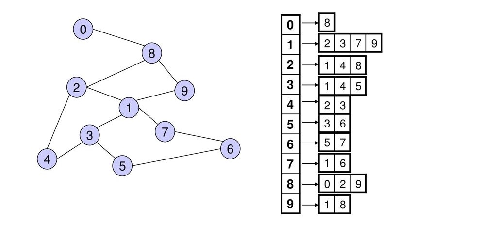

## Graphs

A graph data structure is a collection of nodes (also called vertices) connected by edges. Graphs are used to represent relationships between objects and are widely used in computer science, mathematics, and real-world applications like social networks, maps, and recommendation systems.

### Key Components of a Graph
1. Vertices (Nodes): The fundamental units of a graph. Each vertex can represent an entity (e.g., a person, city, or website).

2. Edges: Connections between vertices. Edges can be:

3. Directed: Have a direction (e.g., A → B).

4. Undirected: No direction (e.g., A — B).

Weight: A value assigned to an edge (optional). Used in weighted graphs (e.g., distance between cities).

### Types of Graphs
#### 1. Directed Graph (Digraph):

* Edges have a direction.

* Example: A → B means you can go from A to B but not necessarily vice versa.

#### 2. Undirected Graph:

* Edges have no direction.

* Example: A — B means you can go from A to B and B to A.

#### 3. Weighted Graph:

* Edges have weights (e.g., cost, distance).

* Example: A --(5)--> B means the edge from A to B has a weight of 5.

#### 4. Unweighted Graph:

* Edges have no weights.

#### 5. Cyclic Graph:

* Contains at least one cycle (a path that starts and ends at the same vertex).

#### 6. Acyclic Graph:

* Contains no cycles.

* Example: Trees are acyclic graphs.

#### 7. Connected Graph:

* There is a path between every pair of vertices (for undirected graphs).

#### 8. Disconnected Graph:

* Some vertices are not connected by any path.

### Graph Representations
#### 1. Adjacency Matrix:
 * A 2D array where matrix[i][j] indicates an edge between vertex i and vertex j.

* For weighted graphs, matrix[i][j] stores the weight.

#### 2. Adjacency List:

* A list of lists or a dictionary where each vertex stores its neighboring vertices.

#### 3. Edge List:

* A list of all edges, often represented as tuples (u, v, w), where u and v are vertices, and w is the weight (optional).

### Common Graph Algorithms
* Traversal:

1. Depth-First Search (DFS): Explores as far as possible along each branch before backtracking.

1. Breadth-First Search (BFS): Explores all neighbors at the present depth before moving deeper.

* Shortest Path:

1. Dijkstra's Algorithm: Finds the shortest path in a weighted graph (non-negative weights).

1. Bellman-Ford Algorithm: Handles graphs with negative weights.

1. Floyd-Warshall Algorithm: Finds shortest paths between all pairs of vertices.

* Minimum Spanning Tree (MST):

1. Kruskal's Algorithm: Uses a greedy approach to build an MST.

1. Prim's Algorithm: Builds an MST by adding the cheapest edge at each step.

* Cycle Detection:

1. Detects cycles in directed and undirected graphs.

* Topological Sorting:

1. Orders vertices in a directed acyclic graph (DAG) such that for every directed edge (u, v), u comes before v.

